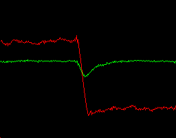

# A Reinforcement Learning assisted Eye-driven Computer Game Employing a Decision Tree-based Approach and CNN Classification
EOG Dataset created for the paper: [A Reinforcement Learning assisted Eye-driven Computer Game Employing a Decision Tree-based Approach and CNN Classification](https://ieeexplore.ieee.org/stamp/stamp.jsp?arnumber=9382978).


Parts of this dataset were also used to train the models in [Measuring the impact of reinforcement learning on an electrooculography-only computer game](https://ieeexplore.ieee.org/abstract/document/8401359/) and [Reinforcement learning motion planning for an EOG-centered robot assisted navigation in a virtual environment](https://ieeexplore.ieee.org/abstract/document/8956348/).


## Source code

Functions necessary to train a CNN using our dataset and to load the CNN model when evaluating some type of EOG input are in folder [**scripts**](/scripts).

Function cnnTrain_regulateBalance.py fetches RGB images from a set folder and trains a CNN model, which is stored in another folder.

Function convolutional_network_eval.py is our actual implementation of server communication with the CNN model handler,
allowing a user to send the function a string with the RGB information from one EOG window for classification by the CNN.


## Requirements
We recommend:
- Python 3.6
- Pytorch 1.2.0
- CUDA 10.1
- sklearn
- imageio

## Data structure
Dataset samples:
<p align="center">
  
  
  
  
  
  
</p>


Dataset is in folder [**RGB_EOG_Dataset**](/RGB_EOG_Dataset/RGB_EOG_dataset.rar), divided into 24 unequal sets. All .png images are named in the format
setX_Y_C.png
where X is the set number, Y the sample number on the set and C the sample class (0-8 in the images, corresponding to 1-9 in the paper).
The data structure is:

```bash
RGB_EOG_Dataset
    |---set1_1_2.png
    |---set1_2_0.png
    |---set1_3_0.png
    
    |---...
```
Class Labels:
| Event Class | Originated by |
|-------------|---------------|
| 0           |   Null Event             |
| 1           |    "Strong" leftward saccade             |
| 2           |    "Medium" leftward saccade            |
| 3           |    "Weak" leftward saccade            |
| 4           |     "Weak" rightward saccade          |
| 5           |     "Medium" rightward saccade          |
| 6           |     "Strong" rightward saccade          |
| 7           |       Single Blink          |
| 8           |      Double Blink         |

## Citation

If you think this dataset is useful for your research, please consider citing:

```
@ARTICLE{perdiz2021eogkart,
  author={J. Perdiz and L. Garrote and G. Pires and U. J. Nunes},
  journal={IEEE Access}, 
  title={A Reinforcement Learning assisted Eye-driven Computer Game Employing a Decision Tree-based Approach and CNN Classification}, 
  year={2021},
  volume={},
  number={},
  pages={},
  doi={10.1109/ACCESS.2021.3068055}}
```
